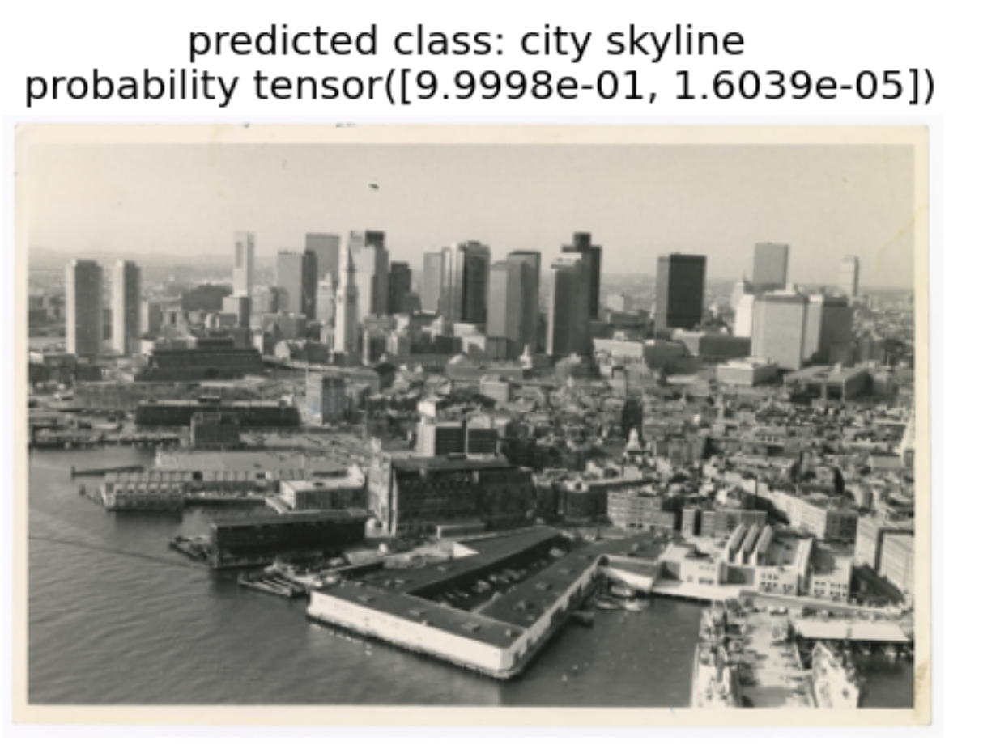
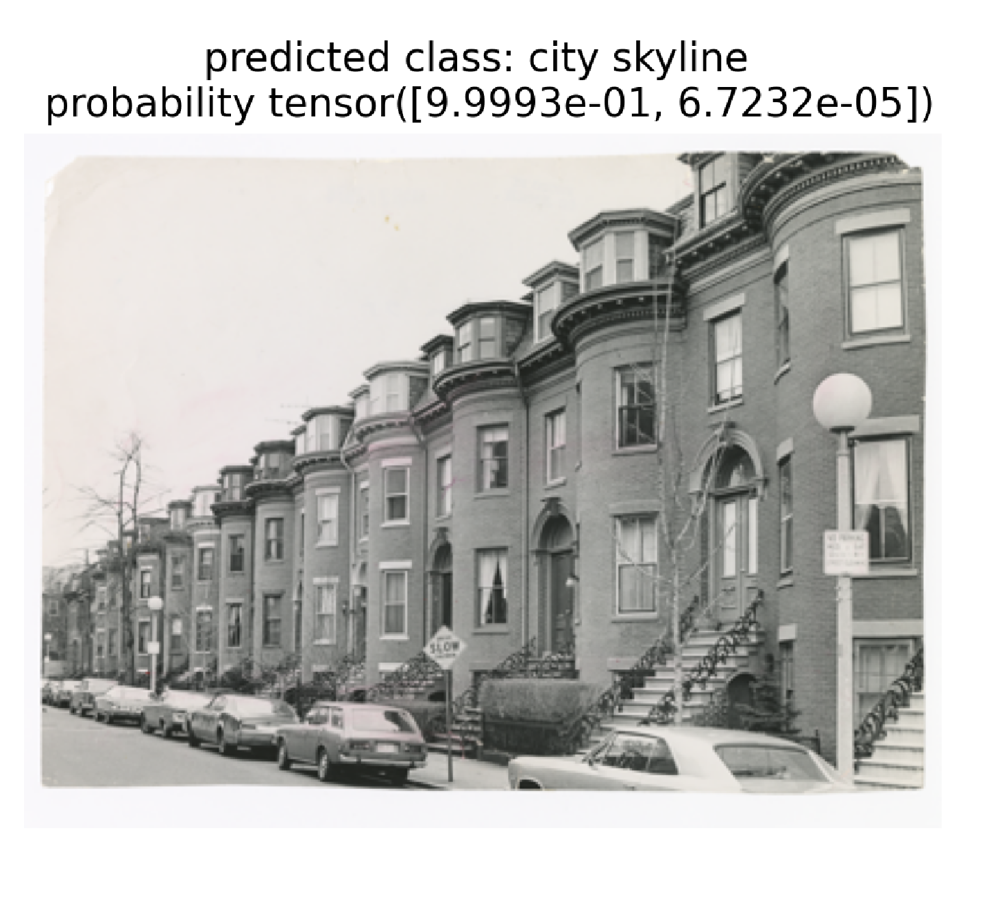
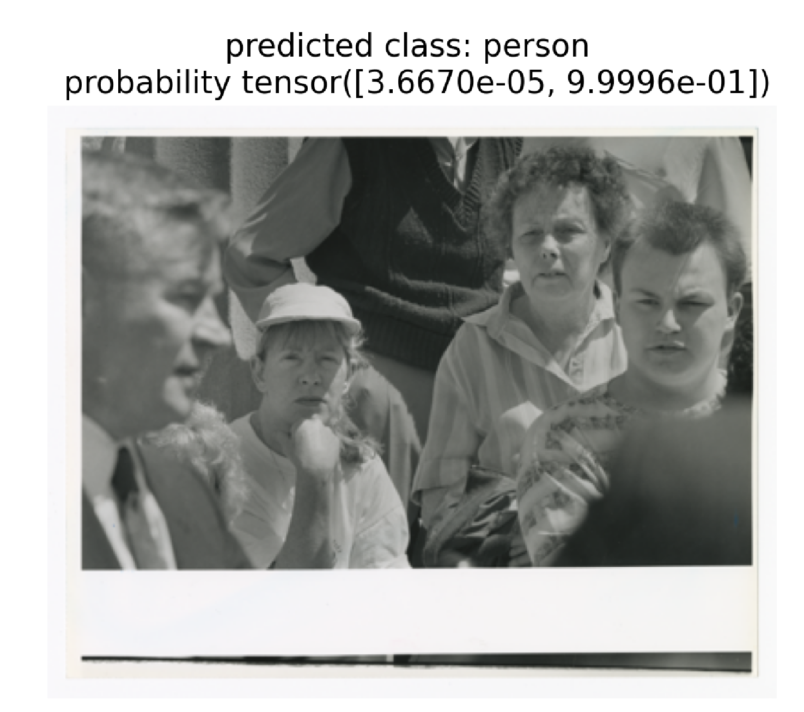
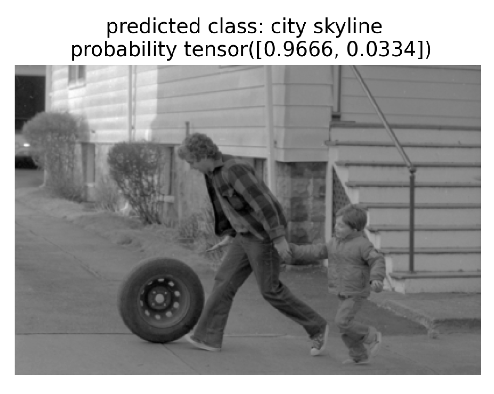
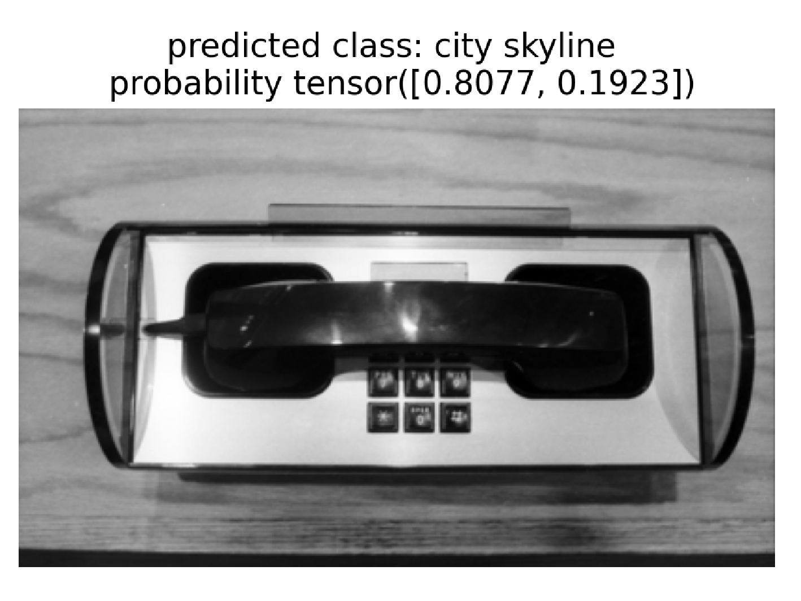
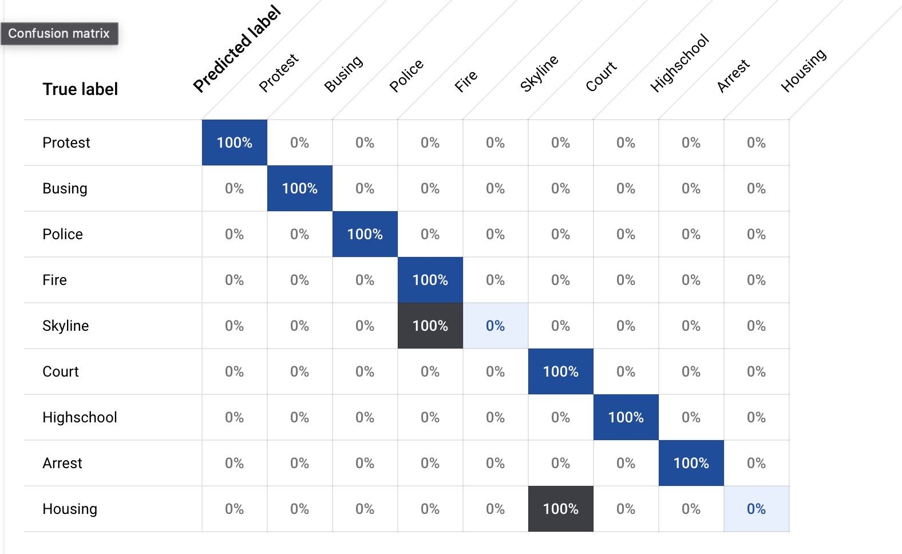

# DS5110 Final Project

## Team members:
* Dominic Dill
* Casey Tilton
* Alexey Rizvanov

## Goal
&nbsp;&nbsp;&nbsp;&nbsp;&nbsp;&nbsp;The Institute for Experiential AI is working with the Northeastern University Library to help categorize thousands of recently digitized historical images from Boston Globe archives. Most of these images lack metadata, and there is an inconsistent format for the few that do. The goal of this project is to utilize data science techniques to aid in the tagging of these images, enabling the public to easily search through these historical photos with relevant keywords.

&nbsp;&nbsp;&nbsp;&nbsp;&nbsp;&nbsp;Alexey, Casey, and Dominic have each attempted to automate the tagging of these images through the use of pre trained models. Fast AI, Google Vision, and DeepFace were the tools of choice, and a brief description of the outcome can be found below.

## #1 - Fast AI - Casey

Fast.AI is a non-profit research group with the stated goal of democratizing deep learning. To that end, their fast.ai python library, built on top of pytorch, makes it faster and easier to train custom deep learning models.

My initial takeaway when reviewing the subset of images shared by the stakeholder was that most of the photos were of the Boston skyline/architecture or of people. Therefore, my goal was to tune a pre-trained convolution neural net model with images downloaded from the internet in order to build an image classifier that could distinguish between photos of the Boston skyline and photos of people. A full [step-by-step walkthrough of how I trained this model is in this notebook](https://colab.research.google.com/drive/1-qPJ6nsIqgH9fXzIPxNJPBX0H6dmnE3S#scrollTo=wtCuX1_r-0s5). 

The code to build and export the model is also located in the source directory. However, it is recommended by the Fast AI developers that deep learning models are trained on cloud servers with access to a GPU. Furthermore, the package provides an easy-to-use GUI through Jupyter notebooks that allow users to select images in the training dataset to remove or relabel with the click of a mouse. 

After training the model by following the demo in the [notebook](https://colab.research.google.com/drive/1-qPJ6nsIqgH9fXzIPxNJPBX0H6dmnE3S#scrollTo=wtCuX1_r-0s5), it is possible to export the model and save to a pickle file. Once it is saved, it can be imported to any python environment without the need for a powerful GPU.

```
learn.export()
path = Path()
path.ls(file_exts='.pkl')
learn_inf = load_learner(path/'export.pkl')
```
### Classifying Boston photos

The trained model is remarkably accurate in predicting whether photos in the Boston image dataset are of buildings or of people. The prediction includes a tensor of probabilities between 0 and 1 that the image belongs to either of the two classes.

The [notebook](https://colab.research.google.com/drive/1-qPJ6nsIqgH9fXzIPxNJPBX0H6dmnE3S#scrollTo=wtCuX1_r-0s5) contains predictions for all 400+ images in the "Subset Images" folder of the provided Boston photo set. Below are a few examples of correctly classifed images.







Provided you install the FastAI package first, a python file is located in ```/src/fastai/``` that can generate a pandas dataframe with predictions for any images saved in ```/data/all_images```. The dataframe where each row has the predicted class, the name of the image, and the probability it belongs to each class. This allows for further analysis and cleaning of the predicted dataset. For example, if we wanted to remove or manually reclassify images that fall below a certain probability threshold, the dataframe allows for easy implementation.

```
make fastai_preds
```

### Limitations

There are two different ways that this model is limited. Although this model is remarkably accurate in its ability to correctly tell the difference between photos of buildings and people, it was not 100% accurate in classifying the images in the Boston photo subset. For example, below is an image of people classified as a city skyline.



The foremost limitation, however, is that the model only predicts between two classes, so every photo run through the model will be classified as a city skyline or person. Although those classes made up a sizeable majority of the Boston photos, the model as it currently exists is useless when it comes to classify other types of images. Examples are displayed below. 




### Future work

Future iterations of this model could include more classes of things that appear in the Boston photos. Alternatively or in addition, predictions could include an "other" class for any probabilities that fall below a given threshold. 


## #2 - Google Vision - Alexey


Learning how to get useful insights from messy data is going to be part
of a data scientist's job no matter what I do with my degree. Messy meta data in my mind has become an industry standard.
This project is no different. Meta data is basically just a description of the data that provides useful information and context.
Our main task for this was to improve the meta data, but first it is important to understand what the meta data already has. 
The meta data we were given was in the form of xml. 

It is not super important to understand xml, since there are plenty of python packages 
that help parse the data into a more digestible format. I used bs4 Beautiful soup to do this. It is one of the best scraper and parsers out there.
With this and looking at the files themselves I realized that there were 2 different meta data schemas. Each of these schemas had different tags for how to 
both give a description of the image and then give the image name. This took a large amount of time an trial and error but I finally got a script that could 
return a list of the image names and descriptions. 

After getting the meta data preprocessed, I needed to find if there were any commonalities in the meta data, so I used a counter from the Collections package to see similar values. 
I did this with both all of the words and the meta data as a whole. After manually looking over this list I found a couple classes that I feel would be good to be used in order 
provide better classification for the rest of the data that the Northeastern University Library  has. These were 


```newclasses = ["HighSchool", "Skyline", "Police", "Busing", "Court", "Low-income","Celtics", "Lawyer", "arrest", "Protest", "housing", "Fire"  ]```
         

With these classes I was able to have access to automated labeled data since I would be able to see get all images related to meta data that included these words. 
With this I could use a classification model to train a model to assign these labels to other images. I decided to use Google Vertex since it allowed for the use of the Google Cloud Services 
as well as a model that could be updated pretty seamlessly. [Vertex Ai](https://cloud.google.com/vertex-ai) allows for training of single and multi labeled models, and was especially useful 
for this project since they have a 90 day free trial with $300 free data storage. In order to actually use Vertex, a jsonl file must be made. A jsonl file is similar to a json file, since they
both use dictionaries to store and relate data. Instead of being in a list however, the different objects are separate by line. The jsonl file for the upload and testing and training split has to look
like the example below and the creation of this file was also automated:


```
{"imageGcsUri": "gs://bucket/filename1.jpeg",  "classificationAnnotation": {"displayName": "daisy"}, "dataItemResourceLabels": {"aiplatform.googleapis.com/ml_use": "test"}}
{"imageGcsUri": "gs://bucket/filename2.gif",  "classificationAnnotation": {"displayName": "dandelion"}, "dataItemResourceLabels": {"aiplatform.googleapis.com/ml_use": "training"}}
{"imageGcsUri": "gs://bucket/filename3.png",  "classificationAnnotation": {"displayName": "roses"}, "dataItemResourceLabels": {"aiplatform.googleapis.com/ml_use": "training"}}
{"imageGcsUri": "gs://bucket/filename4.bmp",  "classificationAnnotation": {"displayName": "sunflowers"}, "dataItemResourceLabels": {"aiplatform.googleapis.com/ml_use": "training"}}
{"imageGcsUri": "gs://bucket/filename5.tiff",  "classificationAnnotation": {"displayName": "tulips"}, "dataItemResourceLabels": {"aiplatform.googleapis.com/ml_use": "validation"}}
```

Now there was a problem with uploading the images from the Northeastern University Library. They would upload but would be corrupted in the process. I could not figure out how to fix this, 
but I still wanted to make a model for a prototype. This lead me to create a Google Image Search scraper using GoogleImagesSearch from [google_images_search](https://pypi.org/project/Google-Images-Search/). 
There is a good tutorial on how to do this from a Youtube channel [Python 360](https://www.youtube.com/watch?v=9NnkLwVf-rw&t=62s&ab_channel=Python360). This allowed me to get 10 images for each of the classes,
 which is the minimum amount of data per class that Vertex needs to run their classifier. This images are not the best images and sometimes were duplicates, but they were enough to train a model. 
 
Since the actual images from Google were not the best, and I mislabeled some of the data on accident, the model was not perfect as seen by the confusion matrix below. 



Vertex does allow for changing of confidence thresholds and this allowed the model to perform a little better. With a threshold of 0.87, the model had 100% precision and 77.8% recall. A high precision like this
means that there was no false negatives, and a high recall means that there were 22.2% false positives. This does mean that the moel is not the best, but could still provide some sort of help. 

Looking into the future there is still a lot of work that can be done. First, this whole project is based off of meta data and images. With more of both, this project would be more accurate. This would mean more
meetings with the library and more looking into how to get more data. More classes could be found and used to make the project useful. That then leads to actually running the model off of the images. One of the biggest problems of this project was the corruption of data. If that could get solved 
this model would be a lot more useful. Finally, running a new version of this model with the last two things on all of the images that need to be classified would be great. 


REPLICATION:

Replicating this project can be hard. First, the data is not available to the public. It is copyrighted data. 
If one does have access to the thumbnail data and can figure out how to not corrupt the data:
- copy the meta data into the metadata folder
- then copy both the subset images folder and the all images folder into the all images folder in the repo.
- then run:
	- ```python src/vertex/class_finding.py #To get a list of word frequencies for manual class finding ```  
	- ```python src/vertex/foldercreation.py #First need to change the newcclasses list with your updated classes ```
	- ```python src/vertex/jsonl_maker.py #To create jsonl file```
- Then you would need to go to the vertex website linked above create an account and then upload the classes foler into a google cloud bucket. 
- Then using the jsonl file on the upload page of the vertex training, you can choose your training test validation data points.
- Then train the model with minimum 8 node hours


Since I couldn't figure out how to uncorrupt the data I used the following methodology:
- Follow all of the previous steps until the folder creation step
- first make a google AI account for the scraper. 
- [create a google image search api project](https://console.developers.google.com/)
- Get a [developer key and credential](https://console.developers.google.com/apis/credentials)
- Put the developer key and credential into the string DK and CX respectively. 
- Update the classes list on line 19.
- Then upload all files to google cloud storage bucket and label them on Vertex


While writing this I did come across a [Python SKD for Vertex](https://cloud.google.com/python/docs/reference/aiplatform/latest). This would make a lot of this project easier, but I have not tried it out yet.


## #3 - DeepFace - Dominic
First, you need to install deepface:

```$ pip install deepface```

Tensorflow is a dependency, so if you don't have it, it will most likely be pulled in as well.


Below description is from [Deepface's GitHub page](https://github.com/serengil/deepface):
> Deepface is a lightweight [face recognition](https://sefiks.com/2018/08/06/deep-face-recognition-with-keras/) and facial attribute analysis 
([age](https://sefiks.com/2019/02/13/apparent-age-and-gender-prediction-in-keras/), [gender](https://sefiks.com/2019/02/13/apparent-age-and-gender-prediction-in-keras/), [emotion](https://sefiks.com/2018/01/01/facial-expression-recognition-with-keras/) and [race](https://sefiks.com/2019/11/11/race-and-ethnicity-prediction-in-keras/)) 
framework for python. It is a hybrid face recognition framework wrapping **state-of-the-art** models: [`VGG-Face`](https://sefiks.com/2018/08/06/deep-face-recognition-with-keras/), [`Google FaceNet`](https://sefiks.com/2018/09/03/face-recognition-with-facenet-in-keras/), [`OpenFace`](https://sefiks.com/2019/07/21/face-recognition-with-openface-in-keras/), [`Facebook DeepFace`](https://sefiks.com/2020/02/17/face-recognition-with-facebook-deepface-in-keras/), [`DeepID`](https://sefiks.com/2020/06/16/face-recognition-with-deepid-in-keras/), [`ArcFace`](https://sefiks.com/2020/12/14/deep-face-recognition-with-arcface-in-keras-and-python/), [`Dlib`](https://sefiks.com/2020/07/11/face-recognition-with-dlib-in-python/) and `SFace`.

&nbsp;&nbsp;&nbsp;&nbsp;&nbsp;&nbsp;The default DeepFace settings (which utilizes openCV's pre trained [haar-cascade](https://docs.opencv.org/3.4/db/d28/tutorial_cascade_classifier.html) face detection algorithm) have been used to count faces in images. While the process is not perfect, it may be a useful tool for distinguishing between images with and without faces. When executed, the `/src/deepface/SearchFunctions/countfaces.py` script will search image files placed in the `/data/all_images/`
for faces. It will then create a `.csv` file with the face counts for each image and store it in the `/data/deepface/deepface_tags/face_counts/` folder. This file could then be used as a filter for downstream classifiers, sending images with no detected faces to models trained for landscape and object detection, and images with detected faces to models designed for facial recognition.

&nbsp;&nbsp;&nbsp;&nbsp;&nbsp;&nbsp;Facial detection is computationally expensive. Initial testing with images from the dataset, which are very high resolution and on the order of 100mb to 300mb, shows that detection times can range from 100s of milliseconds to 10+ seconds per image. OpenCV's haar-cascade algorithm is comparatively quick, but the speed comes with a decrease in the ability to correctly detect faces. [For comparison](https://sefiks.com/2020/08/25/deep-face-detection-with-opencv-in-python/), the ssd method is faster, but even worse at detecting faces, while the mtcnn method is slower, but more accurate. For a more detailed inspection of this, refer to `/src/deepface/DemoNotebooks/FaceDetectorDemoWithBoxes.ipynb`  


&nbsp;&nbsp;&nbsp;&nbsp;&nbsp;&nbsp;Facial detection is only the first step in the 4 step process that is known as facial recognition. Recognition requires not only facial detection, but identification. To accomplish this, known faces are usually stored as vector representations, and then compared against the vector representation of a detected face. If the difference between the two is below a certain threshold, then the detected face becomes recognized. DeepFace's `DeepFace.find()` allows for this to be accomplished with only a few lines of code. The default functionality utilizes the pre-trained openCV haar-cascade and VGG-Face models and cosine similarity to assess vector differences. An example of this can be found in the `/src/deepface/SearchFunctions/facesearch.py` script, which will search through the image files placed in `/data/all_images/` and check them against images of known faces in the `/data/deepface_known_faces/`. A `.csv` file will then be created associating images of unknown faces with the images of known faces. For an easier to follow demo, take a look at `/src/deepface/DemoNotebooks/FindFaces.ipynb`

&nbsp;&nbsp;&nbsp;&nbsp;&nbsp;&nbsp;Future prospects: Through the use of facial recognition, we are able to use any facial image as a query for images containing similar faces. In this case, we could quickly identify images that possibly contain faces of any known perosn, as long as we have a facial image of that person. For example, if all of the photos from this dataset were run through a facial recognition pipeline, then it would be possible to use facial images from outside the dataset to identify images within the dataset that contain similar faces. For more information, see [Deep Face Recognition with Relational Databases and SQL](https://sefiks.com/2021/02/06/deep-face-recognition-with-sql/).


